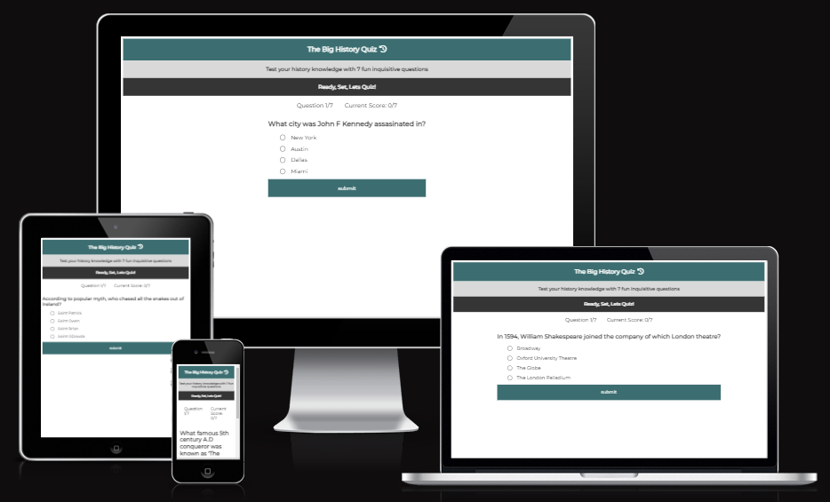
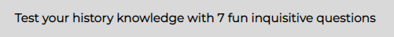

# The Big History Quiz

The Big History Quiz is a fun interactive quiz that generates questions spanning over the last 1000 years of history. The site is very simplistic in its design and aims to be quick, fun and informative, whilst also teaching users snippets of different periods of history.

### Live Site

The live link to the site can be found here - [The Big History Quiz Live Site](https://jimgardner0204.github.io/TheBigHistoryQuiz/)

### Respository 

The link to my repository can be found here - [The Big History Quiz Repository](https://github.com/JimGardner0204/TheBigHistoryQuiz)

### Author

James Gardner

## UX

### Target Audience 

The site is very generic in its target demographic, the questions are generally targeted at GCSE / A level students in terms of knowledge, however the game has been designed for anybody who has a general interest in history and likes to indulge and learn about different periods, rather than specialising on one period - The design of the site also echoes the above in terms of its simplicity and navigation, it has been designed to focus on the quiz rather than how good the site looks.

### Project Goals

The site has been created to improve my javaScript skills as well as further develop my HTML and CSS knowledge and deployment. The obvious goal in terms of the site is to offer a fun, quick learning game that gives instant satisfaction to the user and keeping the questions to a max number of 7, gives the user the desire to re load and answer further questions, in an attempt to beat their score.

## Features 

### Heading and Logo

- Featured at the top of the page, the heading and icon logo are in focus as soon as the user loads the page, immediately drawing their attention to the name of the quiz.
- The colour, font and font-colour used offer great constrasts against each other as well as the sections beneath.

### Subheading

- The subheading content gives very specific information about what the quiz entails in a simple statement, immediately giving the user instructions for what the quiz entails
- Echoing the above statement, the colours and fonts used contrast well.

### Further Subheading

- The final section of the heading gives the user the green light to start the quiz following the instructions set out above. While the game is self explanatory, I liked the design of having the different colours in this pallete and felt this section gave the user motivation to begin the game.

### Progress Area

- The question number and current score text sits directly below the heading section and immediately tells the user the below question number and their current score (always beginning with question 1 and a current score of 0/7). 
- Again this adds impotus to the instructions for the game and again tells the user there will be 7 questions to answer below.
- I chose to keep the design of this section simplistic with a focus on ease of use and contrast for the user.

### Question and Answer Section 

- The question section is where the user will see the quiz question in bold font, with the answer section directly below, comprising of four options with a radio button next to each option, offering the user the chance to pick one of the options.

- Users cannot submit an answer without selecting a radio button

- Once the user has picked their answer, they click on the submit button located directly below the answers and once submitted, the progress section displaying the 'Question Number' and 'Correct Score' will update accordingly.

- The font size in this section has been increased for mobile users to focus more prominently on the quiz element of the site, with the heading section fonts decreased. This allows a much more user friendly mobile experience, as the questions are easier to read, and answers easier to pick through scaled up radio buttons, and fonts as mentioned.

### No Script

- If a user disables javascript, inform the user to enable it so they can use the quiz

### Custome Error Page

- If the user somehow navigates to a page outside the index.html they will see a custom 404 page that looks like the quiz site with a button that takes them to the index.html page

## Future Features

- **Highlight Correct Answers** To give users more learning opportunities through the game, I will implement a function to let the user know the correct answer, should they submit a wrong answer, and also congratulate the user on submitting the correct answer. This will obviously allow the user to gain further knowledge from the game through providing information as they progress.

- **Have Difficulty Levels** To add more variation have difficulty levels that relate to the number of questions asked, easy = 5, medium = 10, hard = 10 etc. and increased number of questions in pool.

- **Add Sound Controls** Let user turn on and off background sound

-**Local Storage High Score** Let user try to beat their own score using local storage

## Testing

### Validator Testing 

### HTML Validation

To validate my HTML files I have used the following site - [HTML Validation](https://validator.nu/)

- Index.html validation 

### CSS Validation

For CSS validation I have used the following site - [CSS Validation](https://jigsaw.w3.org/css-validator/)

- style.css validation

### JS Validation

For javaScript validation I have used the following site - [JSHint](https://jshint.com/)

- script.js

- questions.js

### Accessibility 

- I confirmed the colors and fonts chosen for the site are easy to read and accessible by running the site through lightouse in devtools.

### Compatability and Responsive Testing 

| Tool/Device                   | Browser       | OS          | Screen Width |
|-------------------------------|---------------|-------------|--------------|
| Devtools Emulator Galaxy Fold | Chrome 108    | Windows 10  | 280 x 653    |
| Real Phone iPhone 12          | Safari 15.6.1 | iOS16       | 390 x 844    |
| Real Phone iPhone SE          | Safari 15.6.1 | iOS16       | 375 x 667    |
| Devtools Emulator Pixel 5     | Chrome 108    | Windows 10  | 393 x 851    |
| Devtools Emulator iPad Air    | Chrome 108    | Windows 10  | 820 x 1180   |
| Real Asus E210 Laptop         | Firefox 88    | Windows 10  | 768 x 1366   |
| Real Tablet Amazon Fire 10 HD | Silk          | Fire OS 7.1 | 1200 x 1920  |

### Manual Testing- 

- I have confirmed the quiz game works through serveral tests on the live site
    - This includes testing all radio buttons work correctly and are connected to correct and incorrect answers
    - Testing progress area in terms of question number and correct score
    - Testing the submit button
    - Working through the quiz multiple times, finishing and testing the reload function.

### Outstanding Defects

- Font size on larger desktop screens can appear smaller however this does not implact on the core functionality of the site.

## Deployment 

The site was deployed to GitHub pages. The steps to deploy are as follows:

- In the GitHub repository, navigate to the Settings tab
- On the left hand taskbar, find the tab "pages"
- Find the source section and select the drop down bar option "Deploy from a branch"
- Save the branch and the page will refresh with the link to the live site

## Credits 

Below I have listed and assigned the content used within the website 

### Content

- The icons on the footer were taken from [Font Awesome](https://fontawesome.com/)
- The basic HTML quiz logic in script.js was adopted from Coding with Nicks quiz tutorial: [Coding With Nick](https://codingwithnick.in/create-a-quiz-app-using-html-css-javascript/)
- The quiz content data structure in questions.js was adopted from Coding with Nicks quiz tutorial: [Coding With Nick](https://codingwithnick.in/create-a-quiz-app-using-html-css-javascript/)
- Function getQuestions used to generate random quiz questions on the site was adopted from [Geek for Geeks](https://www.geeksforgeeks.org/how-to-create-an-array-containing-non-repeating-elements-in-javascript/) and adapted by myself to work for my quiz.

### Media

- The Screen shots showing the responsiveness of my site were taken from [Am I Responsive](https://ui.dev/amiresponsive)

## Acknowledgements 

- I would like to acknowledge the input from my code institute mentor Malia Havlicek on her expert guidance and input into this project.
- I have taken key learnings from the Code Institute Love Maths Project
- Websites I'd like to acknowledge for this project are Coding with Nicks Youtube Channel, Geek for Geeks,  W3Schools, Codepen, Simplilearn and SkillCrush.

